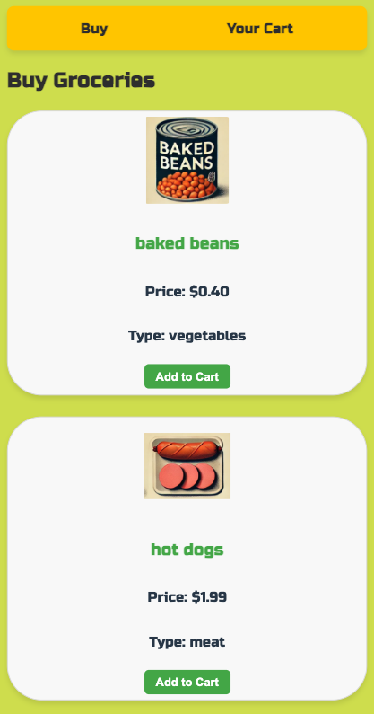
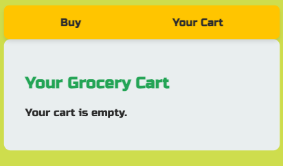
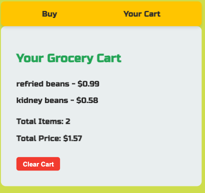

# Grocery King 🛒

**Grocery King** is a frontend-only web application designed to simulate an online grocery shopping experience. Users can browse available grocery items, add items to their cart, and view their cart summary. This project serves as an educational tool and does not include a backend; instead, it relies on sample data to demonstrate core features.

## Preview





## Features

- **Grocery Catalog**: Browse a variety of grocery items with images, prices, and types.
- **Add to Cart**: Select items to add to the shopping cart, with cart persistence using `localStorage`.
- **Cart Summary**: View items in the cart, total price, and clear the cart as needed.
- **Navigation**: Quickly switch between the shopping page and cart summary.

## Project Structure

- **Data**: Static sample grocery data is stored in `public/data/data.json` and includes items with names, prices, images, and types (e.g., meat, vegetables, soup).
- **Components**:
  - **App** (`App.js`): Main application component with routing setup for `Buy` and `Profile` pages.
  - **Buy** (`Buy.js`): Displays grocery items fetched from `data.json` and provides an option to add items to the cart.
  - **GroceryBuyWidget** (`BuyWidget.js`): Individual grocery item widget with image, price, type, and "Add to Cart" button.
  - **Profile** (`Profile.js`): Displays cart items, total price, and provides a button to clear the cart.
  - **Navigation** (`Nav.js`): A simple navbar to switch between the shopping page and cart.
- **Styling**: Custom CSS files for each component are located in `src/styles/`.

## Data Structure

The `data.json` file in `public/data/` contains an array of grocery items in this format:
```json
{
  "name": "baked beans",
  "price": 0.40,
  "image": "/images/beans.png",
  "type": "vegetables"
}

Installation

	1.	Clone the repository:

git clone https://github.com/AJun01/grocerella.git


	2.	Navigate into the project directory:

cd grocery-king


	3.	Install dependencies:

npm install


	4.	Start the development server:

npm start


	5.	Open your browser and go to http://localhost:3000 to view the app.

Usage

	•	View Groceries: Go to the “Buy” page to view available grocery items.
	•	Add to Cart: Click “Add to Cart” for items you want to purchase.
	•	View Cart: Navigate to “Your Cart” to see a summary of items, the total price, and an option to clear the cart.

Future Enhancements

	•	Backend Integration: Incorporate a backend API to handle real-time inventory and user sessions.
	•	User Authentication: Add login and signup functionality for personalized carts.
	•	Enhanced Search & Filter: Enable filtering items by type and price range.

License

This project is open-source and available under the MIT License.

Happy shopping with Grocery King! 🎉
